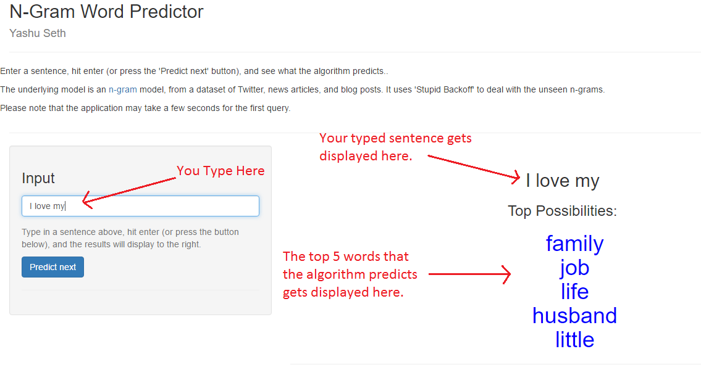

N-Gram Word Predictor
========================================================
author: Yashu Seth
date: July 13, 2016
font-family:'Arial'
autosize: true

Introduction
========================================================
If you have not tried the application yet, click [here](https://yashu-seth.shinyapps.io/N-gram_Word_Predictor/)

Around the world, people are spending an increasing amount of time on their mobile devices for email, social networking, banking and a whole range of other activities. But typing on mobile devices can be a serious pain. This application helps the users in making their typing experience effortless.

<u>Chief Features</u>
- Prdicts the top 5 possibilities of words that the user will type next.
- Can be used to group together words to form sensible sentences.

How to use the App
=======================================================

Algorithm and Tools used
=======================================================
- N-gram model with "Stupid Backoff" ([Brants et al 2007](http://www.cs.columbia.edu/~smaskey/CS6998-0412/supportmaterial/langmodel_mapreduce.pdf))

- Checks if highest-order (here, n=5) n-gram has been seen. If the required n-gram is not found it looks for a lower order n-gram.

- The [tm](https://cran.r-project.org/web/packages/tm/tm.pdf) and [RWeka](https://cran.r-project.org/web/packages/RWeka/index.html) packages were used for the tasks like tokenizaton, data cleaning, creating the term document matrix and the frequency tables.

- The [data.table](https://cran.r-project.org/web/packages/data.table/vignettes/datatable-intro.pdf) package was used to store the n-grams.

Future
=======================================================
The code for creating n-grams, cleaning data and prediction is available on [GitHub](https://github.com/yashu-seth/N-Gram-Word-Predictor). Any suggestions are most welcome.
- The current algorithm does not consider contextual information beyond 5-grams. This is an area that can be worked upon.
- More data can be used to train the model given enough computing power. I plan to use AWS to get a better performing model in the future.
- The app takes a few seconds for the first query. This can be improved. A possible solution (perhaps) could be to use databases instead of the current data tables.
